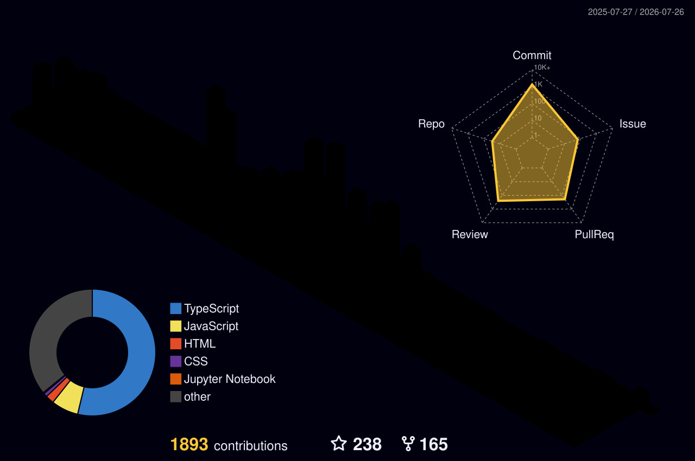

<!-- Centered Typing Text -->
<p align="center">
  
</p>


<p align="center">
  
     •
  
  
  <a href="https://github.com/sponsors/Shubham-cyber-prog">
  
</a>
</p>

- 🔭 I’m currently working on [Portfolio](https://tripolio.netlify.app/)
- 🌱 I’m currently learning **Node.js**, **Docker**, and **DevOps**
- 👨‍💻 All of my projects are available at [GitHub](https://github.com/Shubham-cyber-prog)
- 📫 Reach me at: **sn343555@gmail.com**
- 📄 Check out my [Resume](https://drive.google.com/file/d/18LQPmXDf634owLnqbpXtWU4CICSZixSO/view?usp=drivesdk)


[](https://github.com/ryo-ma/github-profile-trophy)


<p align="center">
  
  
  
</p>

<h3 align="center">Connect with Me</h3>
<p align="center">
  <a href="https://linkedin.com/in/subham-nayak-00276930b" target="_blank">
    
  </a>
  <a href="https://www.codechef.com/users/subham_nayak06" target="_blank">
    
  </a>
  <a href="https://www.hackerrank.com/sn343555" target="_blank">
    
  </a>
  <a href="https://codeforces.com/profile/subhamn123" target="_blank">
    
  </a>
  <a href="https://leetcode.com/u/010806/" target="_blank">
    
  </a>
  <a href="https://auth.geeksforgeeks.org/user/sn343b2w0" target="_blank">
    
  </a>
</p>


  Tech Stack & Tools

<div align="center">

### 🔥 Core Languages
<p align="center">
  
  
  
</p>

### 🎨 Frontend Development
<p align="center">
  
  
</p>

### ⚡ Backend & Database
<p align="center">
  
</p>

### ☁️ DevOps & Cloud
<p align="center">
  
  
</p>

### 🧠 AI/ML & Tools
<p align="center">
  
  
</p>

</div>


<h2 align="center">📊 GitHub Summary</h2>

<p align="center">
  
   
  
</p>

  
<h2 align="center">⚡ More About Me ⚡</h2>
<div align="center" style="font-size: 16px; line-height: 1.8;">

🔭 <b>Currently working on:</b> Full Stack Projects and Hackathons  
🌱 <b>Learning:</b> AI, System Design, and DevOps  
👯 <b>Looking to collaborate on:</b> MERN Stack or Hackathon Projects  
💬 <b>Ask me about:</b> React, JavaScript, Node.js, MongoDB, UI/UX  
⚡ <b>Fun fact:</b> I debug faster when I play Lofi beats!

</div>
<br>
<div align="center"><a href="#"></a></div>
<hr/>

[](https://holopin.io/@shubhamcyberprog)


## Certification Badges 🪶

<div style='display:flex; align-items:center; gap: 10px;' align='center'>

  <a href="https://badgr.com/public/assertions/T3fcheyZQH6xVQkQADwjSA" target="_blank">
    
  </a>

  <a href="https://www.credly.com/badges/c2edaee0-1a9a-484f-9b24-275dbf1e1446/public_url" target="_blank">
    
  </a>

</div>


<!--
For future use
<a href="https://www.instagram.com/hemant.gz/">
  
</a>
<a href="https://leetcode.com/">
  
</a>
-->

<p align="center">
  

  
</p>


<h4 align="center">
  
```diff
+@ @ @ @ @ @ @ @ @ @ @ @ @ @ @ @ @ @ @ @ @ @ @ @ @ @ @ @+
@@       o o                                           @@
@@       | |                                           @@
@@      _L_L_                                          @@
@@   ❮\/__-__\/❯ Programming isn't about what you know @@
@@   ❮(|~o.o~|)❯  It's about what you can figure out   @@
@@   ❮/ \`-'/ \❯                                       @@
@@     _/`U'\_                                         @@
@@    ( .   . )     .----------------------------.     @@
@@   / /     \ \    | while( ! (succeed=try() ) ) |     @@
@@   \ |  ,  | /    '----------------------------'     @@
@@    \|=====|/                                        @@
@@     |_.^._|                                         @@
@@     | |"| |                                         @@
@@     ( ) ( )   Testing leads to failure              @@
@@     |_| |_|   and failure leads to understanding    @@
@@ _.-' _j L_ '-._                                     @@
@@(___.'     '.___)                                    @@
+@ @ @ @ @ @ @ @ @ @ @ @ @ @ @ @ @ @ @ @ @ @ @ @ @ @ @ @+
```

</h4>  

<!-- Snake Game Repo View -->
<div align="center">
  
</div>

<br/>

<summary>
  <g-emoji class="g-emoji" alias="chart_with_upwards_trend" fallback-src="https://github.githubassets.com/images/icons/emoji/unicode/1f4c8.png">📈</g-emoji>
  <strong>𝚆𝚊𝚔𝚊𝚃𝚒𝚖𝚎 𝚂𝚝𝚊𝚝𝚜 : </strong>
</summary>

<a href="https://wakatime.com/">
  
</a>

<br>

<a href="https://wakatime.com/@04ae4d42-f7cb-4e4a-9801-1cd54e703de6"></a>


**🐱 My GitHub Data** 

> 📦 ? Used in GitHub's Storage 
 > 
> 🏆 425 Contributions in the Year 2025
 > 
> 🚫 Not Opted to Hire
 > 
> 📜 19 Public Repositories 
 > 
> 🔑 0 Private Repositories 
 > 
**I'm an Early 🐤** 

```text
🌞 Morning                160 commits         ██████░░░░░░░░░░░░░░░░░░░   23.05 % 
🌆 Daytime                243 commits         █████████░░░░░░░░░░░░░░░░   35.01 % 
🌃 Evening                289 commits         ██████████░░░░░░░░░░░░░░░   41.64 % 
🌙 Night                  2 commits           ░░░░░░░░░░░░░░░░░░░░░░░░░   00.29 % 
```
📅 **I'm Most Productive on Saturday** 

```text
Monday                   94 commits          ███░░░░░░░░░░░░░░░░░░░░░░   13.54 % 
Tuesday                  73 commits          ███░░░░░░░░░░░░░░░░░░░░░░   10.52 % 
Wednesday                67 commits          ██░░░░░░░░░░░░░░░░░░░░░░░   09.65 % 
Thursday                 62 commits          ██░░░░░░░░░░░░░░░░░░░░░░░   08.93 % 
Friday                   60 commits          ██░░░░░░░░░░░░░░░░░░░░░░░   08.65 % 
Saturday                 206 commits         ███████░░░░░░░░░░░░░░░░░░   29.68 % 
Sunday                   132 commits         █████░░░░░░░░░░░░░░░░░░░░   19.02 % 
```


📊 **This Week I Spent My Time On** 

```text
🕑︎ Time Zone: Asia/Kolkata

💬 Programming Languages: 
JavaScript               2 hrs 7 mins        ███████████░░░░░░░░░░░░░░   45.11 % 
Bash                     42 mins             ████░░░░░░░░░░░░░░░░░░░░░   15.12 % 
JSON                     39 mins             ███░░░░░░░░░░░░░░░░░░░░░░   13.95 % 
CSS                      30 mins             ███░░░░░░░░░░░░░░░░░░░░░░   10.92 % 
C++                      22 mins             ██░░░░░░░░░░░░░░░░░░░░░░░   07.82 % 

🔥 Editors: 
VS Code                  4 hrs 43 mins       █████████████████████████   100.00 % 

🐱‍💻 Projects: 
MERN-Expense-Tracker     2 hrs 25 mins       █████████████░░░░░░░░░░░░   51.35 % 
Book-Reading-Tracker     1 hr 4 mins         ██████░░░░░░░░░░░░░░░░░░░   22.72 % 
CPP                      22 mins             ██░░░░░░░░░░░░░░░░░░░░░░░   07.86 % 
backend                  17 mins             ██░░░░░░░░░░░░░░░░░░░░░░░   06.33 % 
Unknown Project          14 mins             █░░░░░░░░░░░░░░░░░░░░░░░░   05.16 % 

💻 Operating System: 
Linux                    4 hrs 43 mins       █████████████████████████   100.00 % 
```

**I Mostly Code in JavaScript** 

```text
JavaScript               7 repos             █████████░░░░░░░░░░░░░░░░   36.84 % 
HTML                     6 repos             ████████░░░░░░░░░░░░░░░░░   31.58 % 
CSS                      4 repos             █████░░░░░░░░░░░░░░░░░░░░   21.05 % 
TypeScript               1 repo              █░░░░░░░░░░░░░░░░░░░░░░░░   05.26 % 
Ruby                     1 repo              █░░░░░░░░░░░░░░░░░░░░░░░░   05.26 % 
```


**Timeline**


<!--END_SECTION:waka-->
<!--Wakatime stats-->
<!-- <a href="https://wakatime.com"></a> -->

<p align="center" style="background-color: #000; padding: 10px;">
  <a href="https://wakatime.com">
    
  </a>
</p>


<p align="center">
    
  <h4 align="center"><code>📊 𝙶𝚒𝚝𝙷𝚞𝚋 𝙼𝚎𝚝𝚛𝚒𝚌𝚜</code></h4>
</p>


<!-- Cyan Wave Footer - shorter height -->


<div align="center">
  <a href="#">
  
    </a>
</div>
